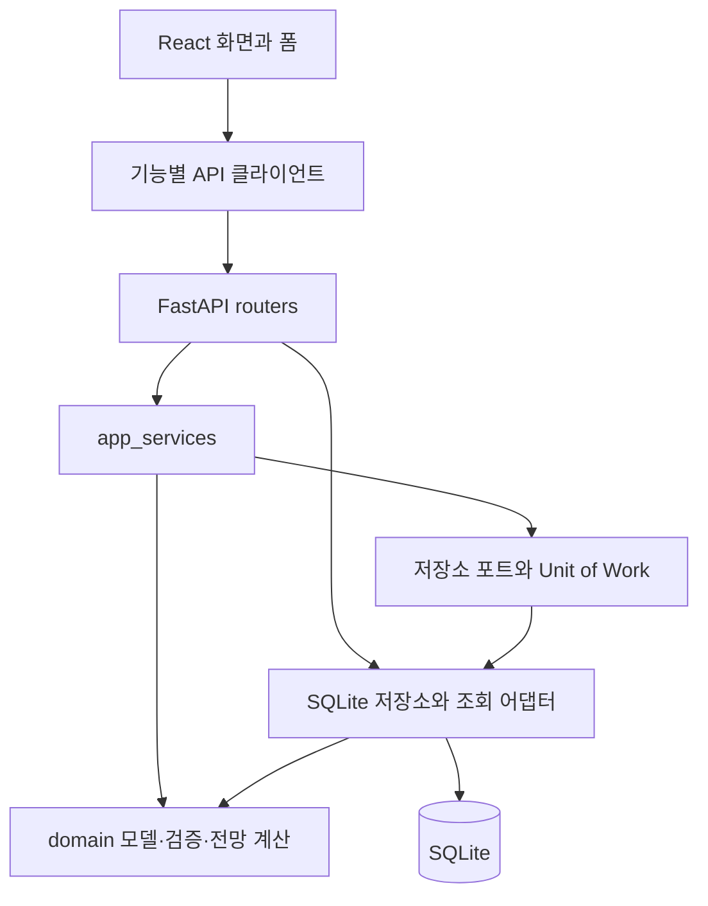
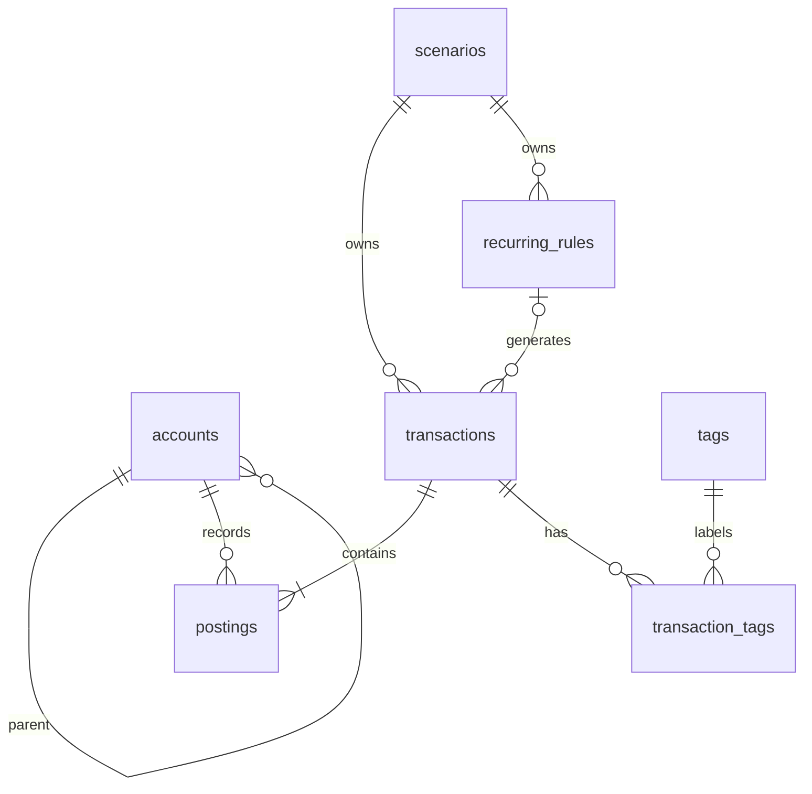
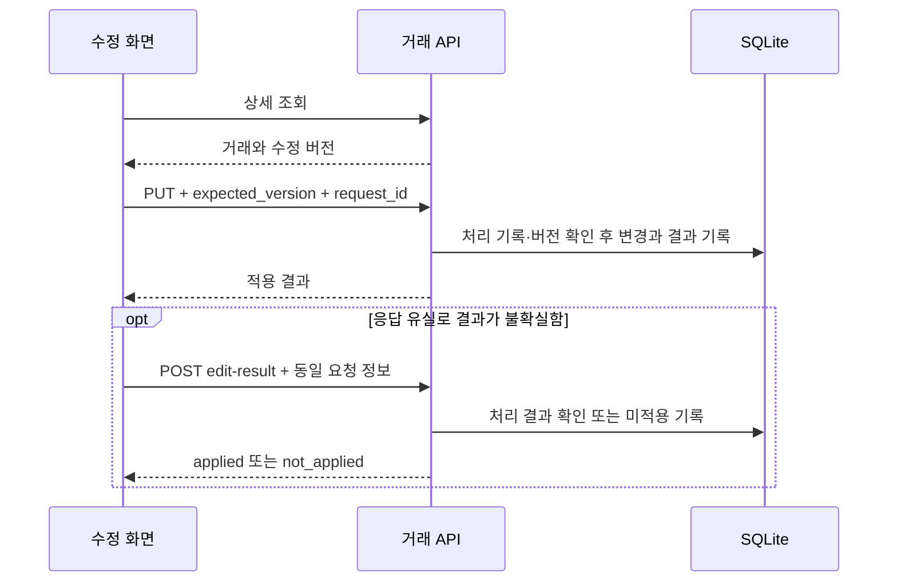

# MoneyMap 현재 구조 분석

분석일: 2026-09-13 · 대상: `../../MoneyMap` · 확인한 HEAD: `2153ffd`

이 문서는 MoneyMap 코드를 처음 읽는 사람이 화면, API, 업무 규칙, 저장소가 어떻게 연결되는지 파악하도록 돕는 안내서다. 저장소의 소스와 설정을 정적으로 분석했다. 서버·테스트·마이그레이션을 실행하지 않았으며 실제 DB와 개인 거래 원본은 조회하지 않았다. 아래 링크의 경로는 이 문서가 있는 `taco-skill/test`를 기준으로 한다.

## 1. 제품과 구현 범위

MoneyMap은 **복식부기 개인 가계부와 미래 자산 시뮬레이터를 결합한 로컬 단일 사용자 애플리케이션**이다. 실제 거래를 기록하는 장부를 중심으로, 반복 규칙과 가상 시나리오를 이용해 순자산과 현금 잔액을 전망한다.

화면은 React와 TypeScript로 작성했고, FastAPI가 HTTP API를 제공한다. 데이터는 Python 표준 라이브러리의 `sqlite3`로 읽고 쓴다. 도메인 모델과 검증에는 Pydantic을 사용한다. 백엔드와 프론트엔드는 별도 프로세스로 실행된다.

[VERSION](../../MoneyMap/VERSION)은 `0.6.0.0`이지만, 현재 코드에는 거래 직접 수정, 계정 정렬, 태그와 과거 CSV 이관 등 [CHANGELOG의 Unreleased](../../MoneyMap/CHANGELOG.md) 항목도 포함되어 있다. 백엔드와 프론트엔드 패키지의 메타데이터 버전은 `0.1.0`으로 남아 있다. 따라서 버전 문자열 하나로 구현 범위를 판단하기보다 코드와 변경 기록을 함께 확인해야 한다. 분석 시점의 `git status --short` 출력은 비어 있었다.

## 2. 디렉토리 지도

```text
MoneyMap/
├── backend/
│   ├── moneymap/
│   │   ├── api.py                 # 앱 생성, 시작 처리, 미들웨어, 라우터 조립
│   │   ├── dependencies.py        # 요청별 DB 연결과 저장소 구성
│   │   ├── http_errors.py         # 도메인 오류의 HTTP 변환
│   │   ├── routers/               # 기능별 HTTP 입출력
│   │   ├── app_services/          # 시나리오·전망 등 유스케이스 조정
│   │   ├── domain/                # 회계 모델, 검증, 계산, 저장소 인터페이스
│   │   ├── adapters/sqlite/       # SQL 저장·조회, 트랜잭션, 마이그레이션
│   │   └── legacy_import.py       # 과거 CSV 이관 로직
│   ├── scripts/import_legacy_csv.py
│   ├── tests/                    # 도메인·API·DB·마이그레이션 검증
│   └── pyproject.toml / uv.lock
├── frontend/
│   ├── src/
│   │   ├── main.tsx / App.tsx     # 진입점, 라우팅, 공통 화면 상태
│   │   ├── api/                  # fetch 공통 처리와 기능별 API 클라이언트
│   │   ├── views/                # 화면, 폼, 입력·수정 상태 로직
│   │   │   └── scenarios/        # 시나리오 상세 탭과 조회 훅
│   │   ├── chart/                # 대시보드 전망 차트
│   │   ├── tokens.css            # 공통 디자인 토큰과 스타일
│   │   └── format.ts             # 표시 형식 유틸리티
│   ├── e2e/                      # Playwright 검증
│   └── package.json / vite.config.ts / playwright.config.ts
├── scripts/                      # 통합 개발 실행과 전망 성능 비교
├── docs/designs/                 # 기능 설계와 테스트 계획
├── docs/verification/            # 구현·검증 기록
├── .github/workflows/ci.yml      # 테스트, 빌드, 전망 성능 비교
└── AGENTS.md / CLAUDE.md / DESIGN.md / CHANGELOG.md / TODOS.md
```

`memory`, `plans`, `knowledge`, `.agents`와 작업 상태 문서는 개발 에이전트의 맥락 관리에 쓰인다. 애플리케이션 실행 구조를 이해할 때는 먼저 `backend`, `frontend`, `scripts`를 읽고, 설계 배경이 필요할 때 `docs`를 참고하면 된다.

## 3. 전체 호출 구조



백엔드는 도메인과 저장소 구현을 분리하는 헥사고날 구조를 지향한다. [domain/ports.py](../../MoneyMap/backend/moneymap/domain/ports.py)가 저장소와 작업 단위의 인터페이스를 정의하고, SQLite 어댑터가 이를 구현한다. 계산과 검증의 핵심은 도메인 계층에 있다.

모든 요청이 `router → app_service → domain → adapter` 순서로 흐르지는 않는다. 거래 생성·조회·수정 라우터에는 저장소를 직접 호출하는 경로가 있고, 태그 조회는 라우터에서 SQL을 실행한다. 시나리오 변경은 애플리케이션 서비스와 Unit of Work를 거친다. 구조를 수정할 때는 계층 이름만 보고 판단하지 말고 해당 기능의 실제 호출 경로를 따라가야 한다.

근거: [routers/transactions.py](../../MoneyMap/backend/moneymap/routers/transactions.py), [app_services/scenarios.py](../../MoneyMap/backend/moneymap/app_services/scenarios.py), [adapters/sqlite/uow.py](../../MoneyMap/backend/moneymap/adapters/sqlite/uow.py).

## 4. 프론트엔드: 화면과 상태의 위치

[App.tsx](../../MoneyMap/frontend/src/App.tsx)는 내비게이션과 라우팅뿐 아니라 연결 상태, 장부 상태, 알림, 데이터 갱신 신호를 관리한다. `refresh()`가 `gen` 값을 증가시키면 각 화면은 이 변화를 계기로 데이터를 갱신한다. 주요 상태는 React 훅과 화면별 로직에 분산되어 있다.

| URL | 화면 | 주요 역할 |
|---|---|---|
| `/` | `Dashboard.tsx` | 잔액과 실제·기준·시나리오 전망 표시 |
| `/transactions/new` | `TxnInput.tsx` | 일반·분할 거래 입력 |
| `/transactions` | `History.tsx` | 거래 내역, 태그 필터, 수정 진입 |
| `/transactions/:id/edit` | `TxnEdit.tsx` | 기존 거래 수정, 충돌 처리·저장 결과 미확정 시 복구 |
| `/accounts` | `Accounts.tsx` | 계정 트리, 설정, 순서, 개시잔액 |
| `/rules` | `Rules.tsx` | 실제 장부의 반복 규칙 |
| `/scenarios` 및 `/scenarios/archived` | `Scenarios.tsx` | 활성 시나리오와 보관함 |
| `/scenarios/:id` 및 `/:tab` | `ScenarioDetail.tsx` | 개요·가정·정보 탭 |

거래 생성과 수정은 [TransactionForm.tsx](../../MoneyMap/frontend/src/views/TransactionForm.tsx)를 공유한다. 입력값 구성과 검증은 `transactionInputState.ts`, 수정 요청 구성과 단계 전환은 `transactionEditState.ts`에서 다룬다. 따라서 폼의 표시 문제와 저장 상태 문제는 서로 다른 파일에서 추적해야 한다.

시나리오 조회는 [useQuery.ts](../../MoneyMap/frontend/src/views/scenarios/useQuery.ts)를 사용한다. 이 훅은 조회 키, 로딩 결과, 오류, 재시도를 관리하고 `AbortController`로 이전 요청을 취소한다. 상세 화면도 별도로 요청을 취소하고 방문 수명을 관리해, 화면 이동 뒤 도착한 응답이 현재 화면을 덮어쓰지 않도록 한다.

[api/core.ts](../../MoneyMap/frontend/src/api/core.ts)는 공통 `fetch`와 `ApiError`를 제공한다. 응답의 `detail.code`와 `detail.message`, 그 밖의 문맥 정보를 보존하며, 헤더가 필요한 요청을 위해 `reqWithHeaders`를 제공한다. 계정·거래·규칙·시나리오·리포트 요청은 각 API 모듈로 나뉜다.

## 5. 백엔드: 시작 처리와 API 경계

[api.py](../../MoneyMap/backend/moneymap/api.py)의 `create_app()`가 앱의 조립 지점이다. 시작 시 DB를 초기화·마이그레이션하고 파일 DB에는 일일 백업을 시도한다. 이후 상태·계정·거래·규칙·시나리오·리포트 라우터를 등록한다.

[dependencies.py](../../MoneyMap/backend/moneymap/dependencies.py)는 요청마다 SQLite 연결을 만든다. GET·HEAD 요청은 명시적인 읽기 트랜잭션을 시작하므로 여러 조회가 같은 스냅샷을 사용한다. 요청 종료 시 남은 트랜잭션을 롤백하고 연결을 닫는다. 저장소와 Unit of Work는 변경 사항을 커밋하는 경계를 관리한다.

| 라우터 | 대표 API | 책임 |
|---|---|---|
| `status.py` | `/api/health`, `/api/status` | 연결 확인, 검산·백업·마지막 입력 상태 |
| `accounts.py` | `/api/accounts`, `/api/accounts/reorder`, `/{id}/settings` | 계정 생성·설정·보관·정렬·개시잔액 |
| `transactions.py` | `/api/transactions`, `/{id}/edit-result`, `/api/tags` | 실제 거래와 수정 결과 확인, 태그, 입력 보조 |
| `rules.py` | `/api/rules`, `/api/materialize` | 실제 반복 규칙과 거래 생성 |
| `scenarios.py` | `/api/scenarios` 및 하위 경로 | 생성·편집·보관·복원·삭제·복제, 규칙·예정 거래 |
| `reporting.py` | `/api/balances`, `/api/projection`, `/api/dashboard-projection` | 잔액과 전망 계산 |

일반 거래 생성 API는 서버에서 실제 장부 ID를 지정한다. 가상 시나리오의 예정 거래는 시나리오 하위 API로 처리한다. 이 경계가 실제 기록과 가정을 구분한다.

거래 생성·수정·수정 결과 확인 요청에는 64 KiB 본문 제한이 있다. 거래 입력 DTO에도 문자열 길이, 분개 수, 금액 범위 등의 제한이 있다. 도메인 오류는 [http_errors.py](../../MoneyMap/backend/moneymap/http_errors.py)를 통해 HTTP 응답으로 변환된다.

## 6. 데이터 모델과 회계 규칙

핵심 모델은 `Account`, `Transaction`, `Posting`, `RecurringRule`, `Scenario`다. 금액은 [Money](../../MoneyMap/backend/moneymap/domain/money.py) 값 객체로 표현하며, 통화의 최소 단위를 기준으로 정수를 사용한다. 도메인은 통화 정보를 갖지만 일반 거래 HTTP 입력은 원화 기준이므로, 이를 완성된 다중 통화 UI로 해석하면 안 된다.



| 테이블 | 구조상 의미 |
|---|---|
| `accounts` | 자산·부채·수익·비용·자본 계정, 부모, 정렬 순서, 버전, 보관·그룹·시스템·현금 포함 설정 |
| `transactions` | 시나리오 소유 거래, 날짜·항목·메모, 입력 출처, 확정 상태, 수정 버전 |
| `postings` | 거래를 계정별 부호 있는 금액으로 나눈 분개 |
| `recurring_rules` | 출금·입금 계정, 금액, 일정, 시작·종료일, 실제 생성 진행 정보 |
| `scenarios` | 실제 장부 또는 가상 시나리오의 기준일·상태·버전·규칙 모드 |
| `tags`, `transaction_tags` | 재사용 태그와 거래의 다대다 관계 |
| `transaction_import_provenance` | 가져온 거래의 원본 추적 정보 |
| `calculation_revisions` | 실제 장부·반복 규칙·현금 설정의 변경 식별 정보 |
| `scenario_id_sequence` | 시나리오 ID 발급 상태 |
| `transaction_edit_requests` | 수정 요청의 식별자·입력 해시·적용 결과를 기록하는 확인용 데이터 |

[Transaction](../../MoneyMap/backend/moneymap/domain/transaction.py)은 분개가 최소 두 개이고, 통화가 같으며, 금액 합계가 0인지 검증한다. 예를 들어 카드 식비는 비용 계정에 양수, 카드 부채 계정에 음수를 기록한다. 개별 계정의 표시 부호와 원장 내부 부호는 구분해야 한다.

SQLite도 같은 핵심 규칙을 트리거로 검증한다. 저장소는 `posted=0` 상태에서 거래와 분개를 구성하고 마지막에 `posted=1`로 확정한다. 확정 시 검산하고, 조회는 확정된 거래를 대상으로 한다. 거래 수정은 하나의 쓰기 트랜잭션 안에서 확정을 풀고 변경한 뒤 재확정하므로, 확정 분개를 보호하는 트리거와 수정 기능이 함께 존재할 수 있다.

근거: [database.py](../../MoneyMap/backend/moneymap/adapters/sqlite/database.py), [transaction_edit.py](../../MoneyMap/backend/moneymap/adapters/sqlite/transaction_edit.py), 각 `*_migration.py`.

## 7. 주요 기능의 실행 흐름

### 거래 입력과 수정

거래 입력값은 화면에서 초안 검증을 거쳐 `/api/transactions`로 전달된다. 서버는 실제 장부의 도메인 거래를 만들고 SQLite 저장소에 저장한다. 마지막 계정 조합과 최근 입력은 `/api/transaction-input/last-pair`, `/recent`에서 별도로 조회한다.

수정은 단순히 거래를 덮어쓰는 요청이 아니다. 먼저 상세 조회로 수정 버전을 받고, PUT 요청에 `expected_version`과 `request_id`를 보낸다. 서버는 기존 처리 기록과 버전을 확인한 뒤 원자적으로 변경하고 결과를 기록한다. 응답이 유실되면 `/edit-result`로 해당 수정 요청의 결과를 확인한다. 이 확인 API 자체가 거래 수정을 재실행하지는 않는다.



프론트엔드는 `editing`, `saving`, `conflict`, `uncertain`, `resolving` 등의 단계로 수정 상태를 표현한다. 서버의 수정 결과 계약과 화면의 상태 전환을 함께 읽어야 충돌 처리와 재시도 동작을 이해할 수 있다.

근거: [transactionEditState.ts](../../MoneyMap/frontend/src/views/transactionEditState.ts), [domain/transaction_edit.py](../../MoneyMap/backend/moneymap/domain/transaction_edit.py), [transaction_edit_migration.py](../../MoneyMap/backend/moneymap/adapters/sqlite/transaction_edit_migration.py).

### 반복 거래 생성

화면 앱은 시작할 때 `/api/materialize`를 호출하고 새로 생성된 반복 거래를 배너로 알린다. 일정 해석은 `domain/schedule.py`, 생성 판단은 `domain/materialize.py`, DB 반영은 `adapters/sqlite/materialization.py`에서 확인한다. 생성된 거래는 원본 규칙의 ID를 보유하지만, 이후 규칙을 수정해도 이미 생성된 거래가 소급해서 바뀌지는 않는다.

확인한 코드에서는 프론트엔드가 시작할 때 보내는 요청으로 반복 거래를 생성한다. 독립적인 상시 스케줄러가 주기적으로 거래를 생성한다고 가정하지 않아야 한다.

### 시나리오와 전망

실제 장부는 보호된 `id=1` 시나리오다. 가상 시나리오는 실제 장부만 기준으로 삼을 수 있으며, 기준일이 있다. 새 시나리오의 `live_additive` 모드는 최신 실제 반복 규칙에 시나리오 고유의 규칙과 예정 거래를 더한다. 과거 규칙 복사 방식은 `legacy_snapshot`으로 남아 있으며 전환 절차와 호환 계산 경로가 따로 있다.

전망은 `reporting.py → app_services/projection.py → ProjectionInputReader → fold_projection()` 흐름으로 읽으면 된다. 읽기 어댑터는 같은 DB 스냅샷에서 기준일까지의 실제 잔액, 실제 규칙, 시나리오 규칙, 기준일 이후 예정 거래, 현금 포함 계정과 변경 버전을 모은다. 도메인 계산기는 이를 이벤트로 펼쳐 기준 전망과 시나리오 전망을 계산한다.

새 전망의 기준선은 실제 반복 규칙을 반영하고, 시나리오 선은 여기에 추가 가정을 반영한다. 기준일 다음 날부터 3·6·12개월을 계산한다. 순자산은 자산·부채 계정의 부호 있는 잔액을 사용하고, 현금 전망은 `include_in_cash`로 선택한 계정만 합산한다. 현금 부족 진단은 최초 부족 구간과 최저 잔액 등을 계산한다.

보관된 시나리오는 읽기 전용이지만 최신 실제 장부로 다시 계산된다. 따라서 시나리오를 보관한다고 과거 전망 결과가 고정되어 저장되는 것은 아니다. 또한 새 전망과 `legacy_projection()`의 계산 경로를 구분해야 한다.

근거: [domain/scenario.py](../../MoneyMap/backend/moneymap/domain/scenario.py), [adapters/sqlite/projection.py](../../MoneyMap/backend/moneymap/adapters/sqlite/projection.py), [domain/projection.py](../../MoneyMap/backend/moneymap/domain/projection.py), [app_services/projection.py](../../MoneyMap/backend/moneymap/app_services/projection.py).

## 8. DB 변경과 복구 구조

현재 [MIGRATIONS](../../MoneyMap/backend/moneymap/adapters/sqlite/database.py)에 정의된 마이그레이션은 여섯 단계다. `PRAGMA user_version`을 기준으로 누락된 단계를 적용하며, 각 단계는 쓰기 트랜잭션으로 실행한다. 단계 번호는 코드가 지원하는 스키마 버전을 뜻하며, 실제 로컬 DB를 조회해 확인한 버전은 아니다.

| 단계 | 변경 |
|---|---|
| 1 | 기본 원장, 계정 설정·정렬, 실제 장부와 시스템 계정 시드 |
| 2 | 시나리오 수명주기와 계산 변경 버전 |
| 3 | 현금 포함 계정 설정 |
| 4 | 거래 입력 출처·항목 키·메모 |
| 5 | 태그와 이관 원본 추적 |
| 6 | 거래 수정 버전, 변경 감지 트리거, 수정 요청 결과 기록 |

기존 파일 DB를 업그레이드하기 전에는 마이그레이션 백업을 생성한다. 일일 백업은 **앱 시작 시** 실행하며, 같은 날짜의 파일이 있으면 건너뛴다. 기본적으로 최근 30개를 유지한다. 별도의 매일 실행 타이머는 이 시작 경로에 없다. 마이그레이션 백업은 일일 백업 회전 대상과 구분된다.

CSV 이관은 [backend/scripts/import_legacy_csv.py](../../MoneyMap/backend/scripts/import_legacy_csv.py)를 통해 실행한다. 적용 옵션과 분류 파일을 받으며 적용 전 백업을 만든다. CSV 이관은 원본 지문과 행 단위 추적을 사용하는 전용 작업이므로, 일반 거래 입력 API와는 별도의 데이터 유입 경로로 봐야 한다. 이관 CLI는 DB 초기화도 호출하므로 명령 자체를 단순 조회로 취급해서는 안 된다.

## 9. 실행·검증 구성

개발 실행의 진입점은 [scripts/dev.sh](../../MoneyMap/scripts/dev.sh)다. 백엔드는 기본 `127.0.0.1:8765`, 프론트엔드는 Vite의 `5173` 포트를 사용한다. 프론트엔드 API 기본 주소는 `http://127.0.0.1:8765/api`다.

| 설정 | 위치와 역할 |
|---|---|
| `MONEYMAP_DB` | 백엔드 DB 경로. 기본값은 실행 디렉토리 기준 `moneymap.db` |
| `MONEYMAP_CORS_ORIGINS` | 허용할 프론트엔드 출처 목록 |
| `VITE_API_BASE` | 프론트엔드 API 주소 |
| `MONEYMAP_E2E_BACKEND_PORT`, `MONEYMAP_E2E_FRONTEND_PORT` | E2E 서버 포트 분리 |
| `MONEYMAP_E2E_API_BASE` | E2E에서 외부 백엔드를 사용할 때 지정 |

개발 스크립트는 `backend`에서 서버를 실행하므로 기본 DB는 `backend/moneymap.db`가 된다. 다른 작업 디렉토리에서 앱을 직접 실행하면 상대 경로의 기준도 달라진다.

| 검증 | 설정된 명령·범위 |
|---|---|
| 백엔드 | `backend`에서 `uv run pytest`: 회계 규칙, 서비스, API, DB, 마이그레이션, 백업, 충돌 처리 |
| 프론트엔드 빌드 | `frontend`에서 `npm run build`: TypeScript 빌드와 Vite 번들 생성 |
| E2E | `frontend`에서 `npm run e2e`: 화면 동작, API 계약, 상태 전환, 오류·회귀 사례 |
| 성능 | 전망 벤치마크와 비교 스크립트로 PR 기준·변경 코드 비교 |

[Playwright 설정](../../MoneyMap/frontend/playwright.config.ts)은 기본적으로 포트별 `/tmp` DB를 준비하고 프론트엔드·백엔드를 실행한다. 테스트가 DB를 공유하므로 worker를 하나로 고정한다. [CI](../../MoneyMap/.github/workflows/ci.yml)는 Python 3.13과 Node 22에서 백엔드 테스트, 프론트엔드 빌드, Chromium E2E를 수행하도록 구성돼 있다. 관련 파일이 변경된 PR에서는 전망 성능도 별도로 비교한다.

이 분석에서는 검증 명령을 실행하지 않았으므로 테스트가 통과하는지, 현재 서버가 정상 동작하는지는 보증하지 않는다. 기존 검증 문서는 당시의 기록으로 참고할 수 있다.

## 10. 기능별로 읽기 시작할 곳

| 확인하려는 내용 | 읽을 순서 |
|---|---|
| 앱 전체 구조 | `frontend/src/App.tsx` → `backend/moneymap/api.py` → `dependencies.py` |
| 거래 입력 | `TxnInput.tsx` → `TransactionForm.tsx` → `transactionInputState.ts` → `routers/transactions.py` → `adapters/sqlite/transactions.py` |
| 거래 수정과 응답 유실 | `TxnEdit.tsx` → `transactionEditState.ts` → `domain/transaction_edit.py` → `adapters/sqlite/transaction_edit.py` |
| 계정 트리와 정렬 | `Accounts.tsx` → `useAccountOrdering.ts` → `domain/account_order.py` → `adapters/sqlite/accounts.py` |
| 시나리오 수명주기 | `ScenarioDetail.tsx` → `routers/scenarios.py` → `app_services/scenarios.py` → `adapters/sqlite/uow.py` |
| 예정 거래와 복제 | `ScenarioAssumptions.tsx` → `app_services/assumptions.py` |
| 순자산·현금 전망 | `ScenarioOverview.tsx` → `routers/reporting.py` → `adapters/sqlite/projection.py` → `domain/projection.py` |
| 스키마·복구 | `adapters/sqlite/database.py` → 해당 마이그레이션 → `backup.py` |

설계 의도는 [docs/designs](../../MoneyMap/docs/designs), 구현 당시의 검증 범위는 [docs/verification](../../MoneyMap/docs/verification)에서 확인한다. UI 작업은 [DESIGN.md](../../MoneyMap/DESIGN.md), 후속 작업은 [TODOS.md](../../MoneyMap/TODOS.md)를 함께 읽으면 된다.

현재 구조를 이해할 때 특히 중요한 경계는 실제 거래와 시나리오 가정, 원장 내부 금액과 화면 표시 금액, 저장 실패와 저장 결과 미확정이다. 이 구분이 화면 상태, API 계약, 도메인 검증, DB 트랜잭션에 걸쳐 반복된다.
